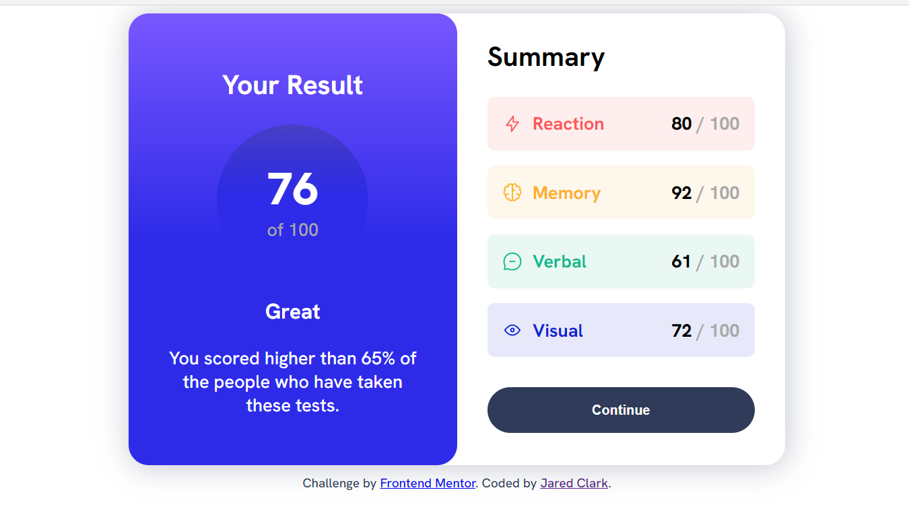
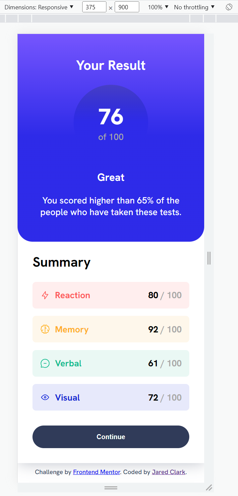

# Frontend Mentor - Results summary component solution

This is a solution to the [Results summary component challenge on Frontend Mentor](https://www.frontendmentor.io/challenges/results-summary-component-CE_K6s0maV). Frontend Mentor challenges help you improve your coding skills by building realistic projects. 

## Table of contents

- [Overview](#overview)
  - [The challenge](#the-challenge)
  - [Screenshot](#screenshot)
  - [Links](#links)
- [My process](#my-process)
  - [Built with](#built-with)
  - [What I learned](#what-i-learned)
  - [Continued development](#continued-development)
- [Author](#author)

## Overview

### The challenge

Users should be able to:

- View the optimal layout for the interface depending on their device's screen size
- See hover and focus states for all interactive elements on the page

### Screenshot

### Links

- Solution URL: [GitHub](https://github.com/helloredfox/results_summary_component)
- Live Site URL: [GitHub Pages](https://helloredfox.github.io/results_summary_component/)

## My process

### Built with

- Semantic HTML5 markup
- CSS custom properties and variables
- Flexbox
- Google Fonts
- Chrome developer tools to inspect responsive design

### What I learned

I Estimated 2 hours 30 minutes total work time. I came fairly close! I was able to finish the design after 2 hours and 39 minutes. I'm pretty happy with how close my estimate was to the actual time it took me!

I had some alignment issues with the little icons in the Summary section. I thought flex was being applied to them and they weren't aligning properly. It turns out that my selector wasn't right and I wasn't applying anything to those elements. It's good to be aware of all the spots you can have problems so you can debug efficiently. 

### Continued development

I'm sure that the HTML is an accessibility nightmare, so I'm going to take some time to read accessibility documentation and edit the HTML. I'll update this when I do.

## Author

- Website - [My codepen page](https://codepen.io/helloredfox/pens/showcase)
- Frontend Mentor - [@helloredfox](https://www.frontendmentor.io/profile/helloredfox)
